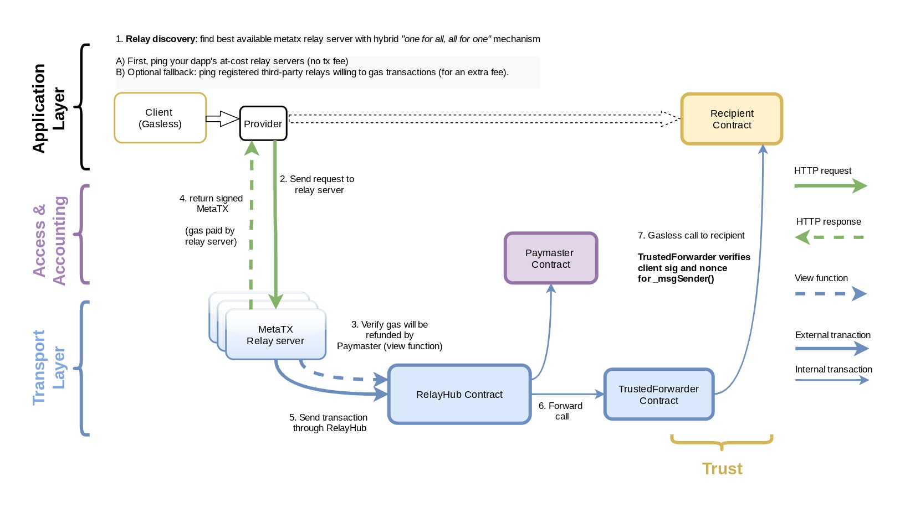

# NFT meta transactions Dapp - A GSN-Based NFT Minting

This is a demo Dapp for demostrating how NFT platorm can utilise meta transaction design pattern in order to ease the end user the burden of having a cryptocurrency (Eg:ETH, MATIC) in their wallet in order to pay for gas fee to mint an NFT.
This a basic NFT minting with ERC-1155 standard, with minimal modifications to support working through GSN, without the client paying for gas.
You still need a wallet, but only for signing transactions, not paying for them.

## Theory research about meta transactions -

What happens when the end user initiated a transaction to an NFT platform in order to mint an NFT? 

First user should get the some cryptocurrency to there wallet so that user can pay for the gas fee for the NFT mint transaction. This can be burdensome for less tech savvy people who want to be part of web3 but don't want to go through the process of KYC through central exchange in order to buy Ether for getting some cryptocurrency to there wallet! 

In these scenario we can make use of meta transactions design pattern where the end user need not have any balance in wallet all he needs to do is sign the transaction. The transaction signed by the end user will be sent to someone else in the network(network/platform which has implemented the meta transaction design pattern) who can pay for this transaction and can send the transaction to the smart contract for execution. 

The meta transaction system/platform will follow the general idea of end user signing the data with his signature and passing on to a sender/relay mechansim where sender/relay mechansim will pay for the transaction and forwards the users transaction request to the smart contract deployed on the blockchain network.

Meta transactions are not natively implemeted to any of the existing platforms, so we have 2 options here in order to make use of meta transaction feature in our Dapps.

1. Create your own third party meta transactions system. (You can mimic the design pattern in Smart Contract or build your platform around this design pattern)

2. Using already existing third party setup for meta transactions like GSN - Gas Station Network

We will go with 2 approch that is using GSN(version-v2) third party decentralised system in order to leverage meta transactions in our Dapp.

### GSN - Gas Station Network

GAS is a decentralised system which acts as a mediator who facilitates a gasless user to send transaction to the blockchain network to execute functionality in Smart Contracts. 

Advantages of using GSN includes - End user can pay the gas fee using a fiat currency or token. Also there will be less hassle from the UX side as well so end user onboarding will be quick and easy.

Architecture of the GAS system -
(Ref from - https://docs.opengsn.org/#architecture)

The process goes like this -

Instead of signing an Ethereum transaction, which would require ETH for gas, a end user signs a message containing information about a transaction they would like to execute and sends it to a relay server. 

Relay server is a server can send a user's transaction and pay themselves for the gas cost instead of end user.

Before the relay server pays for gas it verifies it will get refunded by a Paymaster contract. (Why this step is required? - Because relay server does not run on charity,they need to keep someone accountable for the gas fee it is paying, so relay server will use Paymaster contract for accounting purpose in this case.)

Since Relay Servers are the bunch of servers running in the GSN network, what happens if there is a DOS attack and the Relay servers are taken down all at once?
For this reason it is recommended to every Dapp to have there own set of relay servers. That way they can provide relay service to their native Dapp users at a lower service fee and a higher relay service fee to other end users of differnt Dapps. This way if the native Dapp relay servers are unavailable then the end user can fallback to other Dapp's relay server for an extra service fee. This way more number of Dapps in the GAS network, more relay services hence more availability of relay service. This way we can expect robust availabilty of Relay servers.

**Paymaster** - is a contract for maintaining accountability and access control.
All access control and gas refund logic is implemented inside Paymaster contracts. With Paymaster contract you can write the business logic to decide whether to accept or reject a meta transaction. 
Ex: Accepting only transactions by whitelisted users

**Trusted Forwarder Contract** -
Receipient smart contract which are aware of the meta transaction will only trust certain trusted forwarder contract. Trusted Forwarder contract will verifies the signature and nonce of the original sender before making a gasless call to the receipient smart contract.

**Recipient contract** -
Recipient Smart contract will be aware of the meta transactions when we make the non-meta transaction smart contract to inherit from the base class BaseRelayRecipient.sol (https://github.com/opengsn/gsn/blob/release/contracts/BaseRelayRecipient.sol)
Since the trusted forwarder is the one who is forwarding the transaction to the reciepient contract msg.sender() will always be the address of the trusted forwarder, using this Base contract you can get the original end user who signed the meta transaction request using method _msgSender().

**RelayHub** -
RelayHub connects users running clients, relay servers and paymasters so that participants don't need to know about or trust each other.

RelayHub helps clients discover the best third-party relay server when the dapp's relay servers are down.
prevents third-party relay servers from censoring transactions
rebalances the ETH of relay servers serving their own Paymasters
Ensures Paymasters pay back relay servers for gas fees plus transaction fees.

### Summary of the GSN process
Client uses web3 provider and signs the transactions
With GSN in place Web3 provider will send the signed transaction to one of the relayers in the network through RealyHub
RealyHub is the center of the system
RelayHub gets the paymaster's approval before making the transaction to the system
RelayHub Collects the actual fees from the system (receipeient smart contract) to reemburse the relay server for it's effort.

## Using GSN in minting ERC-1155 tokens
ERC-1155 is a standard interface for contracts that manage multiple token types. A single deployed contract may include any combination of fungible tokens, non-fungible tokens or other configurations (e.g. semi-fungible tokens).

For the sake of simplicity we will be using only mint functionality not batch mint functionality.

## Goal of the project
Goal of this project is to integrate GSN to a standard ERC-1155 smart contract and user must be able to mint ERC-1155 NFTs without paying the gas fee (with 0 eth in there wallet).

## Folder structure
app - contains simple web application content

contracts - contains solidity smart contracts

migrations - contains migration scripts for deploying the smart contracts

## Running the project

1. Run `yarn install `
2. Run `yarn run gsn-with-ganache` to run local ganache and bring up GSN contracts and relayer.
3. In another terminal, run `truffle migrate` to install MetaCoin
4. Run `yarn run dev` to run metacoin demo on `http://localhost:8080`
5. open a browser, and you can mint NFTs with no eth in your (metamask) account

## Snapshots of the project running in browser

#### Notes:
Project is tested for local ganache network.